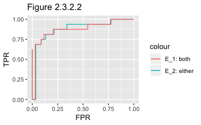
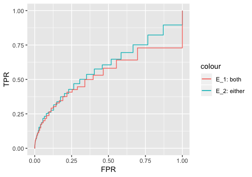

```{r setup, include=FALSE}
knitr::opts_chunk$set(echo = TRUE)
```

### 2.2 Simulation

For the target of comparing the sample performance (such as False Positives, False Negatives) between Node-wise Lasso approach and Graphical Lasso approach, simulation data is generated by the following settings:

Consider the _p_-dimensional multivariate Gaussian distributed random variable $$\boldsymbol{X} = (X_1,X_2,...,X_p)^T \sim \mathcal{N}(0,\boldsymbol{\Sigma})$$, where $\boldsymbol{\Sigma} = \boldsymbol{\Theta}^{-1}$.

In detail, we let $\boldsymbol{\Theta} = \boldsymbol{B}+\delta\boldsymbol{I_{p}} \in \mathbb{R}^{p \times p}$ where $\boldsymbol{I}_p$ stands for the identity matrix and symmetric matrix $\boldsymbol{B}$ has its each off-diagonal entry generated respectively and independently, which will equal to 0 with probability 0.9 or equal to 0.5 with probability 0.1. We calculated and chose $\delta > 0$ to guarantee $\boldsymbol{\Theta}$ is positive definite. We standardized the $\boldsymbol{\Theta}$ to achieve correlation matrix instead of covariance matrix.

Of particular interest is the identification of entries that equals to 0 in the $\boldsymbol{\Theta}$, the sparsity pattern in $\boldsymbol{\Theta}$ links to the true edge set $E$ in the graphical model $G=(V,E)$, where $V={1,...,p}$ is the set of nodes and $E$ is the set of edges $\in V \times V$ between nodes.

Finally, we can specify two arguments in the `simulation(n, p)` function, with `n` as the number of dataset generated, and with `p` as the number of dimension or, say, the number of nodes generated in $\boldsymbol{X} = (X_1,X_2,...,X_p)^T$. As the return of the function, a list consisting of:

1. A $n \times p$ data set.
2. $\boldsymbol{\Theta}$
3. Standardized $\boldsymbol{\Theta}$

For instance, an $100\times 50$ dataset is generated by the following codes.
```
data_list <- simulation(50,100)
simulation_data <- data_list$data
simulation_StandardTheta <- data_list$standardtheta
```
To have a stable and reliable result, we are conducting 50 iterations and having mean value of the results from all the method introduced and discussed in the following chapters.
## 2.3 Node-wise Lasso approach


### 2.3.1 Introduction
One of the approaches that has been deployed to estimate the edge set $E$ is based on the linear regression. Under the assumption of $\boldsymbol{X}$ being multivariate Gaussian distributed random variable, the method of node-wise Lasso is estimate each random variables $X_i$ in $\boldsymbol{X} = (X_1,X_2,...,X_p)^T$ by applying linear regression on the remaining variables. More specifically, for each node $i \in V$, we regress $X_j$ on the remaining variables $X_j=\{X_j : j \in V, j \neq i\}$ to achieve this form $$X_i = \sum_{1 \leq j \leq p, j\neq i}\beta_{ij}X_{j}+\epsilon_{ij}$$

Due to the high dimensionality of our setting, we could implement the Lasso method while regressing all variables to achieve sparse solution. 

For response variable $y_{i}$ and predicators $x_{ij}$, the lasso coefficient $\hat{\beta_{\lambda}}$ is chosen to minimise the equation $$\sum_{i=1}^{n}\left(y_{i}-\beta_{0}-\sum_{j=1}^{p}\beta_{j}x_{ij} \right)^2 + \lambda \sum_{j=1}^{p}|\beta_{j}|$$ where $\lambda \geq 0$ is the tuning parameter. As the $l_{1}$ norm of penalty has the effect of forcing some fo the coefficients to be exactly zero where a large enough $\lambda$ is chosen, Lasso can perform variable selection and build a sparse model containing a subset of all $p$ predictors.

__*Section 2.3.3*__ will introduce and compare different method to choose optimal tuning parameter $\lambda$ and the performance each of them achieves. After choosing the tuning parameter $\lambda$, we could attain the Lasso estimation for each coefficient $\beta_{ij}$, which is $\hat{\beta_{ij}}$. we consider the following rules, named __node-wise Lasso 1__ and __node-wise Lasso 2__ to estimate the Edge Set $E$:

1. __node-wise Lasso 1__: if $\hat{\beta_{ij}} \neq 0$ and $\hat{\beta_{ji}} \neq 0$ are satisfied, then we say nodes $X_i$ and $X_j$ are estimated to be connected. $$\hat{E_{1}} = \left\{(i,j): \hat{\beta_{ij}},\hat{\beta_{ji}} \neq 0, 1\leq i,j \leq p, i \neq j \right\}$$
2. __node-wise Lasso 2__: if either $\hat{\beta_{ij}} = 0$ or $\hat{\beta_{ji}} = 0$, we say nodes $X_i$ and $X_j$ are estimated to be connected. $$\hat{E_{2}} = \left\{(i,j): \exists\hat{\beta_{ij}},\hat{\beta_{ji}} \neq 0, 1\leq i,j \leq p, i \neq j \right\}$$

For each rule and a certain choice of the tuning parameter $\lambda$, by comparing the true edge set $E$ and the estimated edge set $\hat{E}$, the elements in the Confusion Matrix can be calculated and based on that, the True Positive Rate ($TPR_{\lambda}$) and False Postive Rate ($FPR_{\lambda}$) can be attained consequently. As a result, we are able to plot the ROC curve over a fine grid of values of $\lambda$. Furthermore, the Area Under the ROC ($AUROC$) for each method will be plotted to compare the overall performance on recovering the true edge set $E$. These will be introduced in the __*Chapter 2.3.2*__.

### 2.3.2 ROC Curve

After conducting node-wise lasso with different tuning parameter $\lambda$ and different choices of method ($\hat{E_{1}}$ and $\hat{E_{2}}$), one way to compare their performance is to plot the Receiver Operating Characteristic Curve (ROC Curve), created by plotting the true positive rate ($TPR_{\lambda}$) against the false positive rate ($FPR_{\lambda}$) at various choices of $\lambda$. ROC analysis provides us methods to select potentially optimal models and to compare the performance. Further interpretations such as Area Under Curve ($AUC$) can be calculated for more analysis.

For each specific $\lambda$, Lasso estimation for each coefficient $\beta_{ij}$ can be achieved, here in the function `edge_table(data_set, lambda_choice)`. By treating the simulated data and lambda choice, the function will return a $p \times p$ matrix where each entry will be either `TRUE` or `FALSE` which respectively suggests that, for example, at $(i,j)$-entry, `TRUE` means $\hat{\beta_{ij}} \neq 0$ and `FALSE` means $\hat{\beta_{ij}} = 0$. Corresponds to the rules __node-wise Lasso 1__, we say nodes $i$ and $j$ are estimated to be connected as long as Both $(i,j)$-entry and $(j,i)$-entry are `TRUE`. Equivalently, __node-wise Lasso 2__ only requires either $(i,j)$-entry or $(j,i)$-entry are `TRUE` for connecting nodes $i$ and $j$.

Since the sparsity pattern in the $\boldsymbol{\Theta}$ identifies the true edge set $E$ $$E=\left\{(i,j):\Theta_{ij} \neq 0, 1\leq i,j \leq p, i \neq j \right\}$$, function `true_edge(theta)` visualises these and return a $p \times p$ matrix similar to the one returned by the function `edge_table(data_set, lambda_choice)`.

Finally,by making the results from `edge_table` and `true_edge` as arguments function `confusion_matrix(estimate_edge, trueedge, estimate_way)` will perform calculation of confumatrix and return relevant result including $TPR_{\lambda}$ and $FPR_{\lambda}$. Setting `estimate_way = "both"` will allow function perform the calculation through __node-wise Lasso 1__, while `estimate_way = "either"` makes it go through __node-wise Lasso 2__.

As a result, each $\lambda$ will leads to a specific pair of $TPR_{\lambda}$ and $FPR_{\lambda}$, function `ROC_curve` automates this process by computing through all the lambda and return all the coordinates ($TPR_{\lambda}$,$FPR_{\lambda}$).

#### ROC Curve of different methods with same $p$ and $n$.

In this section, the ROC Curves of methods $\hat{E_{1}}$ and $\hat{E_{2}}$ will be compared in parallel with $p$ and $n$ being controlled. we conducted each of the methods mainly under three circumstances: 

1. $p<n$
2. $p=n$
3. $p>n$

First of all, a typical example in situation $p<n$, where $p=20$ and $n=1000$. We have the following example ROC curve (_Figure 2.3.2.2_). In this settings, a large enough volumn of training data will help to achieve a good optimal performance on both methods, and $\hat{E_{2}}$ has very close $AUC$ to $\hat{E_{1}}$'s. More specifically, $\hat{E_{1}}$ has $AUC=0.92849$ while $AUC=0.92817$ for $\hat{E_{2}}$.(Under 50-times iterations setting).

Secondly, we presented an example of $n=p$, where $p=100$ and $n=100$. Here we have the following example ROC curve (_Figure 2.3.2.3_). In this case, we have a low number of observations compared to the number of variables, both methods achieved a lower performance compared to the last case. In detail, $\hat{E_{1}}$ has $AUC=0.50985$ while $AUC=0.55533$ for $\hat{E_{2}}$.(Under 50-times iterations setting).

<center>
{width=200px} {width=200px}
</center>

#### Summary
Generally, by conducting more simulations on different $p$ and $n$ settings, \textbf{Table 1} is generated to show all the outcomes. 

Vertically, when we fix the value of p, Both $\hat{E_{1}}$ and $\hat{E_{2}}$ had their performance increased while $n$ went larger, which means that the more train data we can attain, the better performance tha node-wise Lasso can achieve. However, when we fix the value of $n$, the performance of both methods doesn't show a monotonic trend over the $p$, or rather, we noticed that when $\frac{p}{n}$ being closer to 0, the performance doesn't vary much even $p$ increase from 10 to 100.

Horizontally, in the case of $p \leq n$(refer to lines with $\frac{p}{n} \leq 1.0$ in the Table 1), there is not much difference in performance between $\hat{E_{1}}$ and $\hat{E_{2}}$. In these case shown in the table, both method can attain $AUC \geq 0.50$, which does mean $\hat{E_{1,2}}$ are quite useful for estimating graphical model. However, in the cases when $\frac{p}{n}$ increase towards $1$, it is noticable that $\hat{E_{2}}$ will become a more reliable and productive method compared to the $\hat{E_{1}}$. In the cases when $p > n$ (refer to first three lines in the Table 1), ranging from $\frac{p}{n}=2.0$ to $10.0$, $\hat{E_{2}}$ had apparent better capability than $\hat{E_{1}}$. For instance, $AUC(\hat{E_{2}})$ is 58% higher than $AUC(\hat{E_{1}})$ in the $n=10, p=20$ case. However, both methods had decreased to $\leq0.50$ when $p > n$, which means usually the methods will have higher $FPR$ than $TPR$.

In conclusion, considering all the possible cases between $n$ and $p$, our data had shown that $\hat{E_{2}}$ might be a better choice, since $\hat{E_{2}}$ have a more stable performance over the $n,p$ settings. However, for the cases of $p > n$, it is still recommended to find an alternative method to deploy, since even $\hat{E_{2}}$ can not deliver a good enough result.

Vertically, __under each $\frac{p}{n}$ setting, $\hat{E_{2}}$ will usually achieve better result than the $\hat{E_{1}}$__, although both of the methods perform very well in $\frac{p}{n}=0.02$, in which big enough data allows lasso and linear regression to inference the hidden structure of the edge set. Similarly, both methods perform not well in the setting $\frac{p}{n}=2$, in which "lack of data" leads to this outcome.
