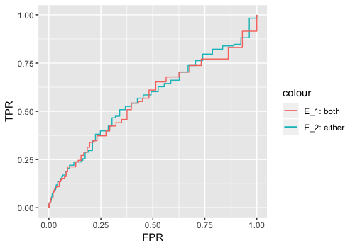
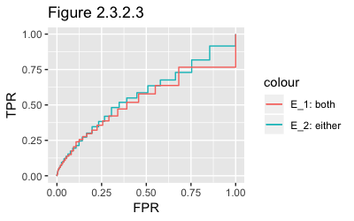
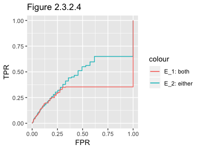

```{r setup, include=FALSE}
knitr::opts_chunk$set(echo = TRUE)
```

### 2.2 Simulation

For the target of comparing the sample performance (such as False Positives, False Negatives) between Node-wise Lasso approach and Graphical Lasso approach, simulation data is generated by the following settings:

Consider the _p_-dimensional multivariate Gaussian distributed random variable $$\boldsymbol{X} = (X_1,X_2,...,X_p)^T \sim \mathcal{N}(0,\boldsymbol{\Sigma})$$, where $\boldsymbol{\Sigma} = \boldsymbol{\Theta}^{-1}$.

In detail, we let $\boldsymbol{\Theta} = \boldsymbol{B}+\delta\boldsymbol{I_{p}} \in \mathbb{R}^{p \times p}$ where $\boldsymbol{I}_p$ stands for the identity matrix and symmetric matrix $\boldsymbol{B}$ has its each off-diagonal entry generated respectively and independently, which will equal to 0 with probability 0.9 or equal to 0.5 with probability 0.1. We calculated and chose $\delta > 0$ to guarantee $\boldsymbol{\Theta}$ is positive definite. We standardized the $\boldsymbol{\Theta}$ to achieve correlation matrix instead of covariance matrix.

Of particular interest is the identification of entries that equals to 0 in the $\boldsymbol{\Theta}$, the sparsity pattern in $\boldsymbol{\Theta}$ links to the true edge set $E$ in the graphical model $G=(V,E)$, where $V={1,...,p}$ is the set of nodes and $E$ is the set of edges $\in V \times V$ between nodes.

Finally, we can specify two arguments in the `simulation(n, p)` function, with `n` as the number of dataset generated, and with `p` as the number of dimension or, say, the number of nodes generated in $\boldsymbol{X} = (X_1,X_2,...,X_p)^T$. As the return of the function, a list consisting of:

1. A $n \times p$ data set.
2. $\boldsymbol{\Theta}$
3. Standardized $\boldsymbol{\Theta}$

For instance, an $100\times 50$ dataset is generated by the following codes.
```
data_list <- simulation(50,100)
simulation_data <- data_list$data
simulation_StandardTheta <- data_list$standardtheta
```
To have a stable and reliable result, we are conducting 50 iterations and having mean value of the results from all the method introduced and discussed in the following chapters.
## 2.3 Node-wise Lasso approach


### 2.3.1 Introduction
One of the approaches that has been deployed to estimate the edge set $E$ is based on the linear regression. Under the assumption of $\boldsymbol{X}$ being multivariate Gaussian distributed random variable, the method of node-wise Lasso is estimate each random variables $X_i$ in $\boldsymbol{X} = (X_1,X_2,...,X_p)^T$ by applying linear regression on the remaining variables. More specifically, for each node $i \in V$, we regress $X_j$ on the remaining variables $X_j=\{X_j : j \in V, j \neq i\}$ to achieve this form $$X_i = \sum_{1 \leq j \leq p, j\neq i}\beta_{ij}X_{j}+\epsilon_{ij}$$

Due to the high dimensionality of our setting, we could implement the Lasso method while regressing all variables to achieve sparse solution. 

For response variable $y_{i}$ and predicators $x_{ij}$, the lasso coefficient $\hat{\beta_{\lambda}}$ is chosen to minimise the equation $$\sum_{i=1}^{n}\left(y_{i}-\beta_{0}-\sum_{j=1}^{p}\beta_{j}x_{ij} \right)^2 + \lambda \sum_{j=1}^{p}|\beta_{j}|$$ where $\lambda \geq 0$ is the tuning parameter. As the $l_{1}$ norm of penalty has the effect of forcing some fo the coefficients to be exactly zero where a large enough $\lambda$ is chosen, Lasso can perform variable selection and build a sparse model containing a subset of all $p$ predictors.

__*Section 2.3.3*__ will introduce and compare different method to choose optimal tuning parameter $\lambda$ and the performance each of them achieves. After choosing the tuning parameter $\lambda$, we could attain the Lasso estimation for each coefficient $\beta_{ij}$, which is $\hat{\beta_{ij}}$. we consider the following rules, named __node-wise Lasso 1__ and __node-wise Lasso 2__ to estimate the Edge Set $E$:

1. __node-wise Lasso 1__: if $\hat{\beta_{ij}} \neq 0$ and $\hat{\beta_{ji}} \neq 0$ are satisfied, then we say nodes $X_i$ and $X_j$ are estimated to be connected. $$\hat{E_{1}} = \left\{(i,j): \hat{\beta_{ij}},\hat{\beta_{ji}} \neq 0, 1\leq i,j \leq p, i \neq j \right\}$$
2. __node-wise Lasso 2__: if either $\hat{\beta_{ij}} = 0$ or $\hat{\beta_{ji}} = 0$, we say nodes $X_i$ and $X_j$ are estimated to be connected. $$\hat{E_{2}} = \left\{(i,j): \exists\hat{\beta_{ij}},\hat{\beta_{ji}} \neq 0, 1\leq i,j \leq p, i \neq j \right\}$$

For each rule and a certain choice of the tuning parameter $\lambda$, by comparing the true edge set $E$ and the estimated edge set $\hat{E}$, the elements in the Confusion Matrix can be calculated and based on that, the True Positive Rate ($TPR_{\lambda}$) and False Postive Rate ($FPR_{\lambda}$) can be attained consequently. As a result, we are able to plot the ROC curve over a fine grid of values of $\lambda$. Furthermore, the Area Under the ROC ($AUROC$) for each method will be plotted to compare the overall performance on recovering the true edge set $E$. These will be introduced in the __*Chapter 2.3.2*__.

### 2.3.2 ROC Curve

After conducting node-wise lasso with different tuning parameter $\lambda$ and different choices of method ($\hat{E_{1}}$ and $\hat{E_{2}}$), one way to compare their performance is to plot the Receiver Operating Characteristic Curve (ROC Curve), created by plotting the true positive rate ($TPR_{\lambda}$) against the false positive rate ($FPR_{\lambda}$) at various choices of $\lambda$. ROC analysis provides us methods to select potentially optimal models and to compare the performance. Further interpretations such as Area Under Curve ($AUC$) can be calculated for more analysis.

For each specific $\lambda$, Lasso estimation for each coefficient $\beta_{ij}$ can be achieved, here in the function `edge_table(data_set, lambda_choice)`. By treating the simulated data and lambda choice, the function will return a $p \times p$ matrix where each entry will be either `TRUE` or `FALSE` which respectively suggests that, for example, at $(i,j)$-entry, `TRUE` means $\hat{\beta_{ij}} \neq 0$ and `FALSE` means $\hat{\beta_{ij}} = 0$. Corresponds to the rules __node-wise Lasso 1__, we say nodes $i$ and $j$ are estimated to be connected as long as Both $(i,j)$-entry and $(j,i)$-entry are `TRUE`. Equivalently, __node-wise Lasso 2__ only requires either $(i,j)$-entry or $(j,i)$-entry are `TRUE` for connecting nodes $i$ and $j$.

Since the sparsity pattern in the $\boldsymbol{\Theta}$ identify the true edge set $E$ $$E=\left\{(i,j):\Theta_{ij} \neq 0, 1\leq i,j \leq p, i \neq j \right\}$$, function `true_edge(theta)` visualise these and return a $p \times p$ matrix similar to the one returned by the function `edge_table(data_set, lambda_choice)`.

Finally,by making the results from `edge_table` and `true_edge` as arguments function `confusion_matrix(estimate_edge, trueedge, estimate_way)` will perform calculation of confumatrix and return relevant result including $TPR_{\lambda}$ and $FPR_{\lambda}$. Setting `estimate_way = "both"` will allow function perform the calculation through __node-wise Lasso 1__, while `estimate_way = "either"` makes it go through __node-wise Lasso 2__.

As a result, each $\lambda$ will leads to a specific pair of $TPR_{\lambda}$ and $FPR_{\lambda}$, function `ROC_curve` automates this process by computing through all the lambda and return all the coordinates ($TPR_{\lambda}$,$FPR_{\lambda}$). _Figure 2.3.2.1_ indicates an example when $p=20,n=100$ based on both method $\hat{E_{1}}$ and $\hat{E_{2}}$.

<center>

</center>

#### ROC Curve of different methods with same $\frac{p}{n}$ ratio.

In this section, the ROC Curves of methods $\hat{E_{1}}$ and $\hat{E_{2}}$ will be compared in parallel with $p$ and $n$ being controlled.

First of all, for $p=20$ and $n=1000$, which leads to the ratio $\frac{p}{n}=0.02$, we have the following ROC curve (_Figure 2.3.2.2_). In this low $\frac{p}{n}$ ratio settings, a large enough volumn of training data will help to achieve a good optimal performance on both methods and $\hat{E_{2}}$ has slightly higher $AUC$ than the $\hat{E_{1}}$. More specifically, $\hat{E_{1}}$ has $AUC=0.99199$ while $AUC=0.99140$ for $\hat{E_{2}}$.(Under 50-times iterations setting).

Secondly, for $p=100$ and $n=100$, which leads to the ratio $\frac{p}{n}=1$, we have the following ROC curve (_Figure 2.3.2.3_). In this case, we have a low number of observations and also a relatively high $\frac{p}{n}$ ratio, both methods achieved a lower performance compared to the last case. In detail, $\hat{E_{1}}$ has $AUC=0.67574$ while $AUC=0.74338$ for $\hat{E_{2}}$.(Under 50-times iterations setting). Moreover, for $p=100$ and $n=200$, which corresponds to the ratio $\frac{p}{n}=2$, ROC curve(_Figure 2.3.2.4_) is plotted. $\hat{E_{1}}$ has $AUC=0.43343$ while $AUC=0.59768$ for $\hat{E_{2}}$.

<center>
  
</center>

In conclusion, by conducting more simulations on different $\frac{p}{n}$ settings, _Table 2.3.2.5_ is generated to show all the outcomes. __Obviously, by increasing the $\frac{p}{n}$ ratio from 0.02 to 2, Both $\hat{E_{1}}$ and $\hat{E_{2}}$ had their performance decreased over the ratio.__ When $\frac{p}{n}=0.02$, both methods achieved impressive performace which is larger than $AUC=0.99$. In the $n=p$ situation, Both methods perform worse than the last case, while $\hat{E_{1}}$'s AUC decreases 31.88% and AUC decreases 25.02% for $\hat{E_{2}}$ from $\frac{p}{n}=0.02$ case. In the end, if $\frac{p}{n}=2$, we can see that $AUC(\hat{E_{1}})$ dropped below 0.5 for the first time, while $AUC(\hat{E_{2}})$ still higher than 0.5.

Vertically, __under each $\frac{p}{n}$ setting, $\hat{E_{2}}$ will usually achieve better result than the $\hat{E_{1}}$__, although both of the methods perform very well in $\frac{p}{n}=0.02$, in which big enough data allows lasso and linear regression to inference the hidden structure of the edge set. Similarly, both methods perform not well in the setting $\frac{p}{n}=2$, in which "lack of data" leads to this outcome.
